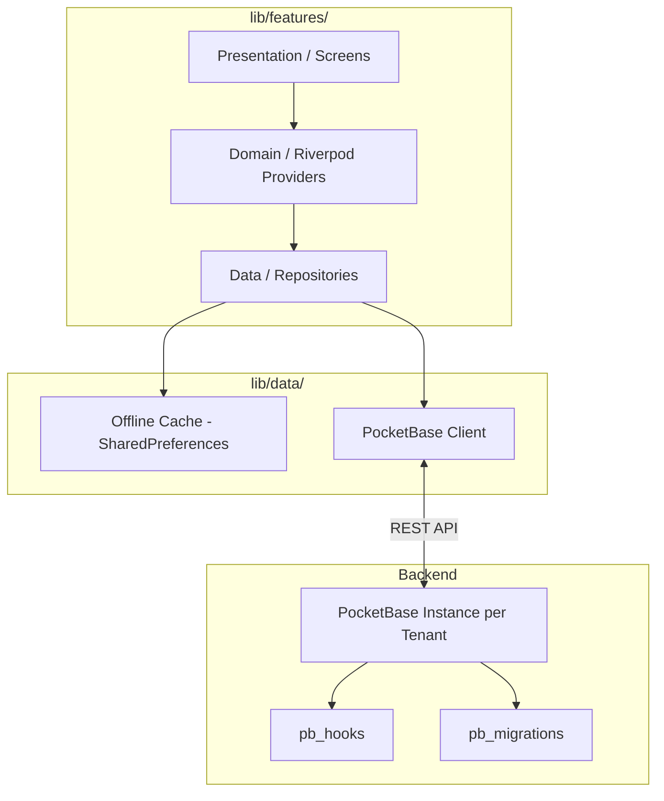

# GymKit - Architecture & Interview Guide

This document is designed to provide a comprehensive explanation of GymKit's inner workings. It is structured as a Q&A to help developers, interviewers, or contributors understand the technical decisions, architecture, and flow of the application.

## 🏗️ High-Level Architecture Diagram

---

## FAQ - Q&A

### Q: What is GymKit and what problem does it solve?
**A:** GymKit is a fast, white-label Gym management application built on Flutter and PocketBase. It solves the problem of high-cost, inflexible legacy gym software by providing a unified codebase that can be deployed instantly for different gym clients, each with their own isolated database and custom branding.

### Q: How does multi-tenancy work?
**A:** We use a strict isolation approach: **One PocketBase instance per client**. 
Instead of complex row-level security to separate gym data in one huge database, each gym gets its own lightweight PocketBase container. The Flutter app determines which backend to talk to based on compile-time variables (`--dart-define=TENANT=slug`) or runtime domain detection on the Web.

### Q: How does the theme system enforce consistency?
**A:** Direct Material color/style usage (e.g., `Colors.red`) is strictly banned in feature code. We use a global `ThemeData` along with a `ThemeExtension<AppTokens>`. The tenant's configuration (colors, logos) is loaded at startup, passed into the `buildTheme` function, and all UI components (`AppButton`, `AppCard`) reactively update to match the client's branding.

### Q: How is state managed?
**A:** We use **Riverpod** for reactive state management. The architecture is cleanly divided:
1. **Data/Repositories** handle PocketBase API calls and offline caching.
2. **Domain/Providers** hold the active state and handle business logic.
3. **Presentation/Screens** simply watch the Providers and rebuild when state changes.

### Q: How are roles and permissions enforced?
**A:** Access control is handled primarily by **PocketBase API Rules** on the backend. The UI simply hides features based on the logged-in user's role (Admin, Staff, Member), but the backend strictly validates every read/write operation, ensuring a member can never modify a staff member's profile.
